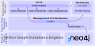

# Higher-Order Graph Database (HO-GDB)

<p align="center">
  
</p>

This is the official implementation of [Higher-Order Graph Databases](https://arxiv.org/abs/2506.19661).

This framework implements a higher-order (HO) graph database (GDB) that uses
lifting and lowering paradigms to seamlessly extend traditional GDBs with
higher-order interactions. The framework is a lightweight, modular, and
parallelizable prototype that offers native support for hypergraphs,
node-tuples, subgraphs, and other HO structures under a unified API. Our work
generalizes both ACID-compliant and eventually consistent systems.


## Setup Guide

In order to use this framework, you need to have a working installation of Python 3.9 or newer.


### Installing HO-GDB

Before executing the installation process, please make sure to activate your Python environment (if any) beforehand.
```bash
git clone https://github.com/spcl/HO-GDB.git
cd HO-GDB
pip install .
```
Please note that the Python packages `hypernetx`, `networkx`, `torch`, `torch_geometric` and `rdkit` are only necessary to run the benchmarks, but not for the framework itself.


### Installing Neo4j

Please refer to the [Neo4j installation manual](https://neo4j.com/docs/operations-manual/current/installation/). Choose one of the following options:

* Download Neo4j and extract, start with
```bash
bin/neo4j start
```
* Run Neo4j using the official Docker image.
* Connect to an AuraDB instance. Make sure to note your username, password, and URL.

You should update the file [HOGDB/.env](HOGDB/.env) according to your configuration and include the necessary credentials or pass these parameters as part of `db_params` in your code.
You should make sure to allocate sufficient memory for the Neo4j server.
We used the Neo4j 5.26.5 Community Edition during our evaluation of HO-GDB.


## Quick Start

Please make sure that you installed Neo4j and setup the configuration, so that HO-GDB is able to access the Neo4j database.
While we currently only support Neo4j as a graph database backend, we provide an abstract Database class together with abstract classes for database sessions and transactions that serve as an API to integrate other graph databases.
These abstract classes can be found in the file [HOGDB/db/db.py](HOGDB/db/db.py).

Once a Neo4j server is running and HO-GDB was installed, you can directly start using HO-GDB.
We provide a simple example of a higher-order graph with a few nodes and a node-tuple in the [examples](examples) directory.
If you are looking for code with a higher complexity, please take a look at the [benchmark](benchmark) directory.

## Datasets and Benchmarks

We discuss the used datasets (ZINC20 and MAG-10 in particular) as well as our benchmark code in [benchmark/README.md](benchmark/README.md).

## Citations

If you find this repository valuable, please give it a star!
Got any questions or feedback? Feel free to reach out and open an issue.
Using this in your work? Please reference us using the provided citation:

```bibtex
@misc{besta2025higher,
  title = {{Higher-Order Graph Databases}},
  author = {Besta, Maciej and Chandran, Shriram and Cudak, Jakub and Iff, Patrick and Copik, Marcin and Gerstenberger, Robert and Szydlo, Tomasz and M\"{u}ller, J\"{u}rgen and Hoefler, Torsten},
  year = 2025,
  month = Jun,
  eprinttype = {arXiv},
  eprint = {2406.19661}
}
```
